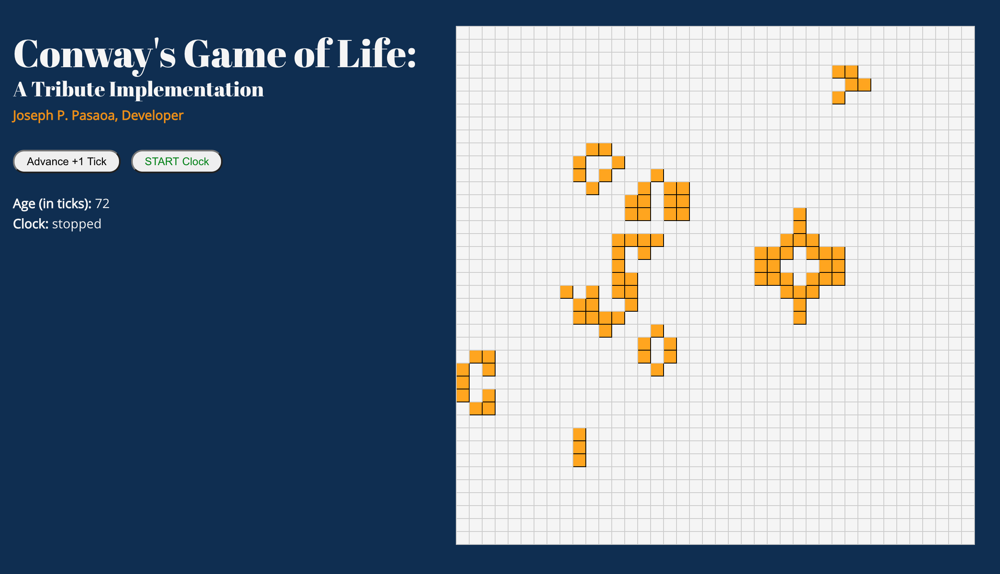

# Conway's Game of Life: A Tribute

## Developer: [Joseph P. Pasaoa](https://github.com/joseph-p-pasaoa) - [(LI)](https://www.linkedin.com/in/josephpasaoa)



An implementation of [Conway's Game of Life](https://en.wikipedia.org/wiki/Conway%27s_Game_of_Life).

---

### Technologies Implemented
+ React
+ Typescript
+ Javascript ES5+
+ Node.js
+ SCSS
+ CSS3
+ HTML5

### Setup
+ To run this project, clone this repo and inside the project folder run locally using npm:
  ```
  $ npm start
  ```
+ The app site will be found at: http://localhost:11011

### To Dos
- Generate random new grid
- Redux me
- Foresight coloration option (for e.g., black = not going to die, red = going to die)
- Grid units customization
- Grid size customization
- Draggable toggling of cells
- Stats
- Stat Visualizations
- Remove interval tick display by combining with interval change input box to display actual when off-focused
- Theme options
- Brush sizes

---

Dedicated to [John Conway](https://arstechnica.com/science/2020/04/john-conway-inventor-of-the-game-of-life-has-died-of-covid-19/), the mathematician who developed this automaton system and passed April 2020 at 82, from the Coronavirus. Rest in Peace.
